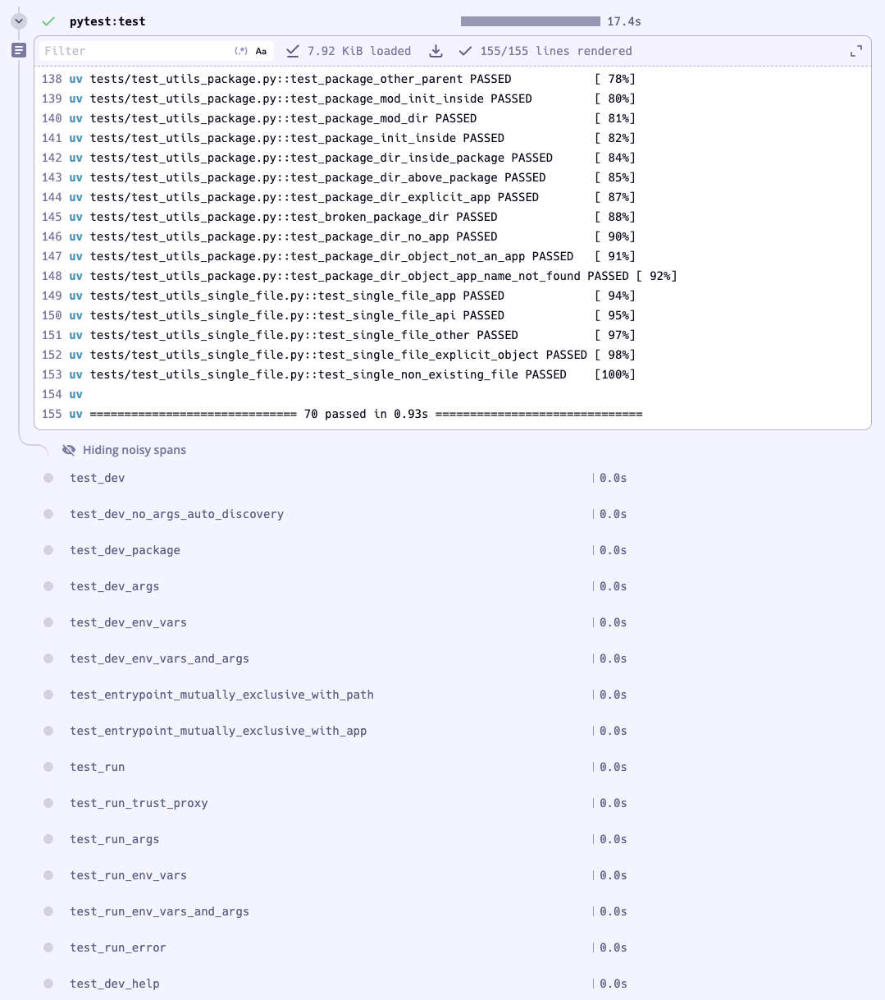

# Pytest Dagger Toolchain

A toolchain for testing Python application with automatic OpenTelemetry tracing

This toolchain automatically injects a `pytest_otel` library for test tracing visibility in Dagger TUI and Dagger Cloud. No configuration required.

**Usage:**

On a python project, using pytest as the test runner:

- initialize a dagger module if not already done: `dagger init .`
- install the `pytest` toolchain: `dagger toolchain install github.com/dagger/pytest`
- run tests: `dagger check pytest:test`. It will:
  - creates a Wolfi based container with `uv`
  - install your project dependencies using `uv sync` (a cache volume is set)
  - inject the `pytest_otel` dependency for automatic test tracing
  - run `pytest`

Example, using `fastly/fastly-cli`:

```console
$ git clone github.com/fastly/fastly-cli

$ cd fastly-cli

$ # Initialize an empty dagger module
$ dagger init

Initialized module fastapi-cli in ~/dev/src/github.com/fastapi/fastapi-cli

$ # Add the pytest toolchain
$ dagger toolchain install github.com/dagger/pytest

toolchain installed

$ # Run tests, with tracing enabled
$ dagger check
✔ pytest:test 17.4s ⣿⣿⣿⣿⣿⣿⣿⣿⣿⣿⣿⣿⣿⣿⣿⣿⣿⣿⣿⣿⣧⣿⣿⣿⣿⣿⣿⣿⡆⡄⣿⣿⡄ OK
```


