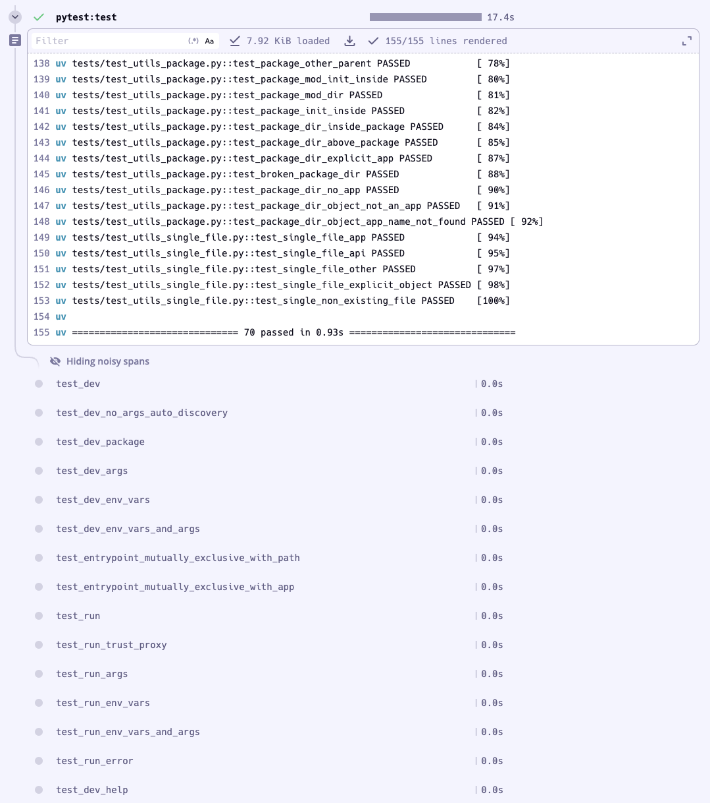

# Pytest Dagger Toolchain

A toolchain for testing Python application with automatic OpenTelemetry tracing

This toolchain automatically injects a `pytest_otel` library for test tracing visibility in Dagger TUI and Dagger Cloud. No configuration required.

**Usage:**

On a python project, using pytest as the test runner:

- initialize a dagger module if not already done: `dagger init .`
- install the `pytest` toolchain: `dagger toolchain install github.com/dagger/pytest`
- run tests: `dagger check pytest:test`. It will:
  - creates an Alpine based container with `uv` (a uv cache volume is set)
  - prepares Python for the requested version via `uv`, failing fast if it can't be resolved
  - injects the `pytest_otel` dependency for automatic test tracing (before your source is added, so it stays cached)
  - installs your project dependencies (automatically via `uv run` for `pyproject.toml` projects, or from `requirements.txt`)
  - export captured stdout, stderr, and Python logging records as OTel logs
  - run `pytest`

`pytest:test` runs against a self-contained Alpine + `uv` base, so it needs no setup. To trace pytest inside your own container instead (your Python, your dependencies, your environment), pass that container to the toolchain or use the lower-level functions directly.

## Usage modes

The toolchain serves three levels of control:

1. **Plain toolchain** - install it and run `dagger check`. Your project is taken
   from the workspace automatically; `pythonVersion` (and `sourcePath`, to target a
   subdirectory of the workspace) are the only knobs commonly set. Everything else
   just works against the bundled Alpine + `uv` base.
2. **Custom image (drop-in)** - set `container` to your own image (your Python, your
   tooling, `uv` or not). It replaces the default base; the module still installs
   `pytest_otel` and runs pytest. If your image is not `uv`-based, set `runner` to
   `PIP` or leave `AUTO` to auto-detect.
3. **Embedded / custom** - call the building blocks directly:
   - `test` - full pipeline (base -> source -> deps -> otel -> pytest), with
     `skipInstallDeps: true` to skip dependency installation when your image already
     has them.
   - `testUv` / `testPip` - run-only: given a container that already has source +
     dependencies, install `pytest_otel` and run pytest. Use these to skip
     detection entirely.
   - `installPytestOtel(ctr, runner)` - install only `pytest_otel` into your
     container (`AUTO` detects the tool; `UV`/`PIP` force one), then run pytest
     yourself.
   - `pytestOtel` - get the bundled `pytest_otel` library as a `Directory` for
     fully-manual integration (it is not yet published to PyPI).

`runner` is `AUTO` | `UV` | `PIP` (default `AUTO`: prefer `uv`, else `pip`).

Example, using `fastly/fastly-cli`:

```console
$ git clone https://github.com/fastly/cli

$ cd cli

$ # Initialize an empty dagger module
$ dagger init

Initialized module fastapi-cli in ~/dev/src/github.com/fastapi/fastapi-cli

$ # Add the pytest toolchain
$ dagger toolchain install github.com/dagger/pytest

toolchain installed

$ # Run tests, with tracing enabled
$ dagger check
✔ pytest:test 17.4s ⣿⣿⣿⣿⣿⣿⣿⣿⣿⣿⣿⣿⣿⣿⣿⣿⣿⣿⣿⣿⣧⣿⣿⣿⣿⣿⣿⣿⡆⡄⣿⣿⡄ OK
```


